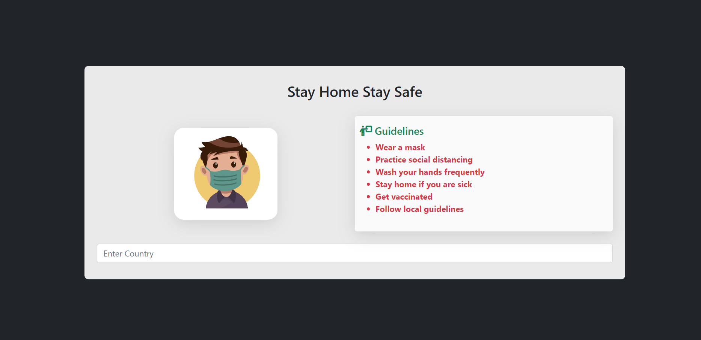
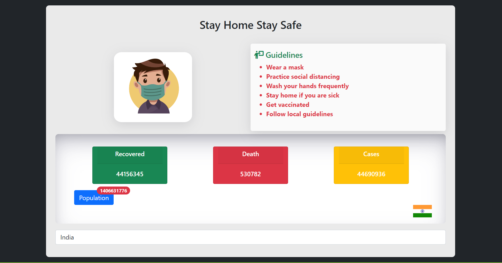
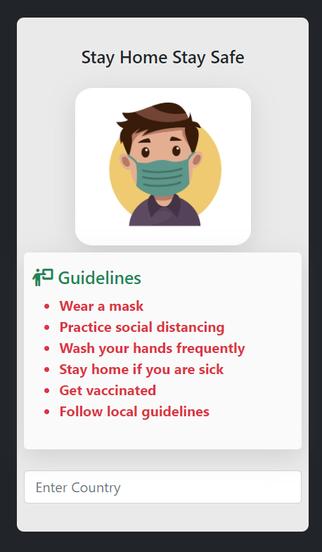
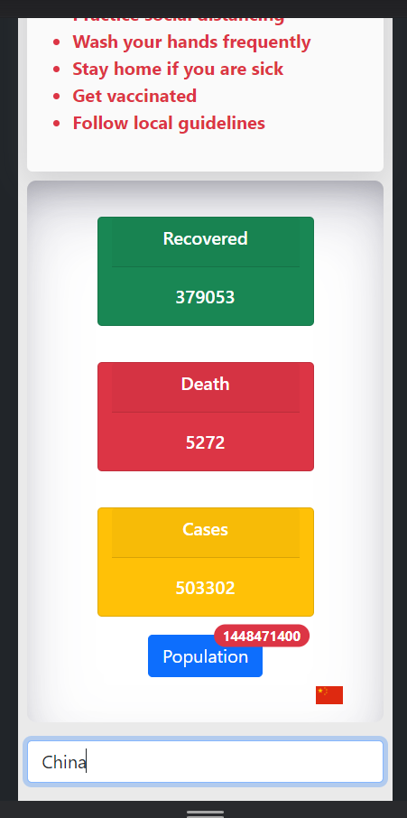

### COVID-19 API Web Application

* This project is an AngularJS web application that fetches data from an online COVID-19 API using routing.
* Routing done based on ```country name``` . User can search the ```country name``` and get the details about it.
* ##### API LINK :  
``` 
https://disease.sh/v3/covid-19/countries 
```

### Technologies Used
<p align="left">
  <a>
    
  </a>
    <a>
  
    </a>
      <a>
  
    </a>
    <a>
  
    </a>

</p>

### Getting Started
###### To run this project on your local machine, follow these steps:
1. Clone this repository using git clone 
```
https://github.com/VrajPatelK/covid19-api-webapp.git
```
2. Navigate to the project directory using 
```
cd covid19-api-webapp
```
3. Open a web browser and navigate to (If live server plugin installed)
``` 
http://localhost:5500 
```

### Features
* Fetches data from an online COVID-19 API using routing by AngularJS.
* Displays COVID-19 statistics in a user-friendly interface.
* Uses Bootstrap to make the interface responsive and mobile-friendly.
* Add search functionality to allow users to search for specific countries.
* Display data on a map to provide a visual representation of COVID-19 statistics.

### Acknowledgments
* Thanks to the creators of the COVID-19 API used in this project.
* Thanks to the Bootstrap team for creating a great CSS framework.


### Preview




<div style="display: flex; justify-content: space-evenly; align-items: center;">
    
    
</div>
